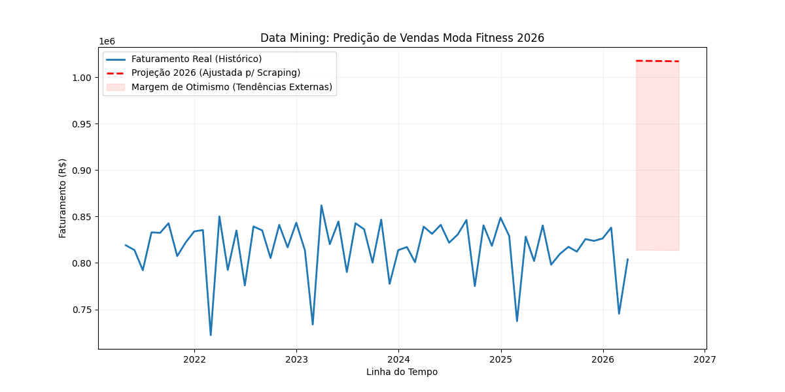

# Data Mining: Predição de Vendas Moda Fitness 2026 🚀

Este projeto faz parte do MBA em Big Data, BI e Analytics (ITLAB - Escola Politécnica UFRJ). O objetivo é prever o faturamento do segundo semestre de 2026 cruzando dados históricos internos com tendências de mercado extraídas via Web Scraping.

#### Visão Geral do Projeto
* **Dataset Interno:** Faturamento histórico (`fVendas.csv`).
* **Dataset Externo:** Extração de tendências da Revista Cláudia (Abril) para o Verão 2026.
* **Modelo:** Regressão Linear Múltipla com ajuste de fator de tendência.
* **Stack:** Python (Pandas, Scikit-Learn, BeautifulSoup, Matplotlib).

#### Arquitetura do Pipeline
O projeto foi dividido em scripts modulares para garantir a governança e limpeza dos dados:
* **`web_scraping_fitness.py`**: Coleta ética de dados respeitando o `robots.txt`.
* **`tratar_scraping.py`**: Limpeza de ruído (Text Mining) e extração de insights reais.
* **`analise_preditiva_final.py`**: Cruzamento de bases e geração do modelo de Machine Learning.

#### Insights Extraídos (Web Scraping)
| Tendência 2026 | Impacto Esperado |
| :--- | :--- |
| Capri Esportiva | Alta conversão em novos SKUs |
| Legging Flare | Tendência de moda com alto ticket médio |
| Short Biker | Item essencial para sazonalidade de Verão |
| Mood Tenista | Estética que impulsiona conjuntos completos |

#### Resultados e Predição
O gráfico final demonstra o impacto da mineração de dados externos no faturamento:

* **Linha Azul:** Faturamento Real Histórico.
* **Linha Vermelha:** Projeção para 2026 ajustada pelo "Fator de Impulso".
* **Área Rosa:** Margem de ganho identificada através do Web Scraping. O modelo sugere um potencial de faturamento atingindo a marca de **R$ 1 milhão/mês** no auge da temporada.

---
*Data Mining - MBA Big Data, BI & Analytics - UFRJ*
